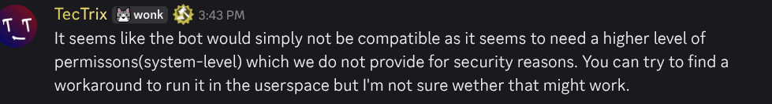

# Unrecommended Hosts

 The Modmail team does not in any way intend to defame, harm, or otherwise create badwill between Modmail and the open source community as a whole, and any hosting provider. We simply provide this list to our users through our experience. We do not in any way imply that these hosts are bad, unreliable, or that it is not possible to use them, we simply state that these are not a good fit for hosting Modmail. 

### Repl.it

- [Website](https://repl.it)
- Repl.it is a provider aimed at hosting websites. Meaning, it does not have the proper tools and features to properly host the Modmail bot.
- This host is particularly problematic, and there have been many documented unexplainable issues that occur when hosting your bot with this method. Because of this it is **strongly discouraged** for use.

### Bot-hosting.net

- [Website](https://bot-hosting.net/)
- bot-hosting.net is a free or low cost hosting provider that bases their hosting platform on the common free and open-source panel [Pterodactyl](https://pterodactyl.io/).
- Hosting on any Pterodactyl panel based host is already challenging, however, bot-hosting.net shares IP addressess among users, which has resulted in high numbers of our users reporting rate limits being applied to their bot. In other words: your bot will randomly stop working with nothing you can do to fix it.

### Wispbyte

- [Website](https://wispbyte.com/)
- Similar setup and issues as Bot-Hosting.net — shared resources and inconsistent reliability.  
- Wispbyte's support team has also been seen to suggest random breaking changes to attempt to make the bot run. They do not work.

### Karlo Hosting
- [Website](https://karlo-hosting.com/)
- Another free or low cost hosting provider based on the Pterodactyl panel, our users have reported unusual difficulties deploying Modmail with this host due to their specific Pterodactyl configuration and limitations.

### Embotic Hosting
- [Website](https://client.embotic.xyz/)
- Despite claiming to provide a VPS, they do not do so, and hosting Modmail is likely not possible. See the response from company representatives below:

1x Screenshot

<figure></figure>

### Discord Bot Hosting
- [Website](https://discordbothosting.com/)
- Pterodactyl based host that can have issues with ratelimits due to shared IP addresses and reasons that have been listed below.


### Why These Are Not Recommended
These hosts generally:
- Use **shared or oversold Pterodactyl setups**  
- Offer **free or ultra-low-cost tiers** with limited resources  
- Experience **rate limits, sleep periods, or unresponsive containers**  
- Provide **no control over environment configuration**
- Hide **legal information regarding their business or company**

If you value stability, security, and consistent uptime, avoid free or oversold shared hosts.  
Refer to [Choosing a Host](../choose-host/README.md) for guidance on reliable alternatives.
