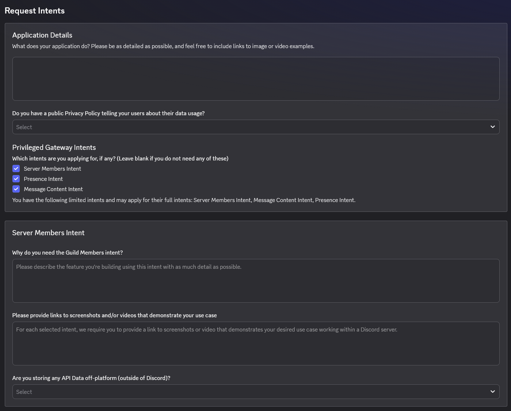
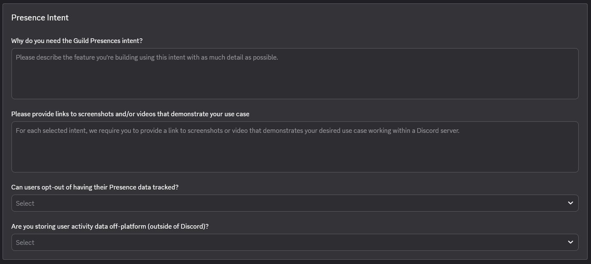
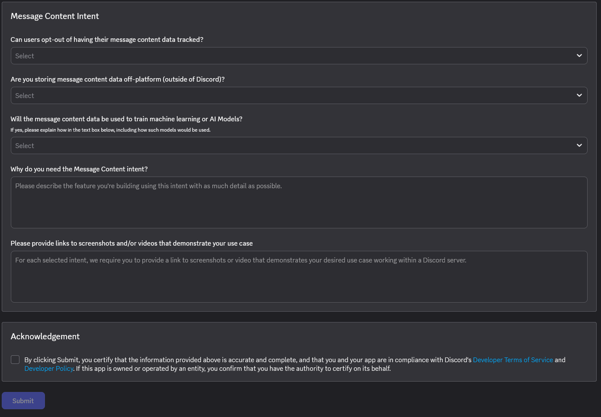

# Discord Intents Review Process


This process does not apply to a majority of Modmail user's. The only time a Modmail bot will need to go through Discord's Intent Review Process is in one of the following two cases:
1. *(for bots in only one server):* If the server your bot is in is close to, or above 10,000 members.
2. *(for bots in multiple servers):* If the combined member count of all the servers your bot is in is close to, or over 10,000 members.


## Background

Discord uses Gateway Intents to control what information is sent to your bot. Some intents, including **Message Content**, **Server Members**, and **Presence**, are considered **Privileged Intents** because they provide access to data that Discord considers more sensitive from a privacy and security perspective. Discord limits access to these intents to ensure developers only collect the information necessary for their bot's functionality.

Modmail requires the **Message Content Intent** to read user messages and create tickets, and the **Server Members Intent** for user information features. Discord now determines privileged intent review eligibility based on the **total number of users your bot can access**, rather than the number of servers your bot is in. Applications with access to 10,000 or more users must complete Discord's intent review process before using privileged intents. During review, Discord will ask why your bot needs the requested intents and how the data is used. For Modmail, clearly explain that message content is required to receive, relay, and manage support tickets, and provide screenshots or videos demonstrating these features if requested.


## Intents Request Form

<figure><figcaption><p>Intents Application Form for Application Details and Server (Guild) Members Intent</p></figcaption></figure>
<figure><figcaption><p>Questions for Prescence Intent <strong>Not Required</strong> for Modmail.</p></figcaption></figure>
<figure><figcaption><p>Message Content Intent Questions and Certification of Answers</p></figcaption></figure>

## Suggested Responses

<details>

<summary>Application Details</summary>



```
What does your application do? Please be as detailed as possible...
-------------------------------------------------------------------
Modmail is a shared inbox bot for server moderation. When a user sends a Direct Message to the bot, it automatically creates a dedicated text channel (a "thread") within a designated staff category in our Discord server. Server staff can read the user's messages in this channel and reply using bot commands. The bot then relays these staff replies back to the user via Direct Message. This allows for organized, private, and collaborative support between users and the moderation team.

```





```
Do you have a public Privacy Policy telling your users about their data usage?
-------------------------------------------------------------------
Select: Yes(required if for any applicayion using the intents or with more then 100 servers.) or No.
```




You will need to adopt a privacy policy for your bot. We have a version you can opt to use [here](privacy-policy.md).


</details>
<details>

<summary>Server Members Intent</summary>



```
Why do you need the Server Members intent?
-------------------------------------------------------------------
Modmail requires the Server Members Intent to accurately check a user's membership status. 

When a user initiates a Direct Message with the bot, the bot must scan the user's shared servers to route the message to the correct server's staff team. Additionally, the bot uses member data to verify staff permissions, ensuring that only authorized moderators can view the modmail threads, use staff commands, and reply to users. 

Finally, tracking member leave events is necessary to immediately detect if a user has left the server, informing the moderation team whether replying to the individual is still possible.

```





```
Please provide links to screenshots and/or videos that demonstrate your use case
-------------------------------------------------------------------
link

```





```
Are you storing any API Data off-platform (outside of Discord)?
-------------------------------------------------------------------
Select: Yes

```





```
Are you storing API Data for 30 days or less?
-------------------------------------------------------------------
Select: No

```



```
How do users contact you to request deletion of their activity data?
-------------------------------------------------------------------
Users can request the deletion of their data by sending a Direct Message to the bot itself to contact the server staff, or by directly messaging one of the server administrators.

```



```
Are you encrypting the data that you store at rest, as is required by our developer policy?
-------------------------------------------------------------------
Select: Yes

```

</details>

<details>

<summary>Message Content Intent</summary>

```
Can users opt-out of having their message content data tracked?
-------------------------------------------------------------------
Select: Yes
```



```
Are you storing message content data off-platform (outside of Discord)?
-------------------------------------------------------------------
Select: Yes
```



```
Are you storing user message content data for 30 days or less?
-------------------------------------------------------------------
Select: No
```




```
How do users contact you to request deletion of their activity data?
-------------------------------------------------------------------
Users can request the deletion of their data by sending a Direct Message to the bot itself to contact the server staff, or by directly messaging one of the server administrators.
```



```
Are you encrypting the data that you store at rest, as is required by our developer policy?
-------------------------------------------------------------------
Select: Yes
```



```
Will the message content data be used to train machine learning or AI Models?
-------------------------------------------------------------------
Select: No
```



```
Why do you need the Message Content intent?
-------------------------------------------------------------------
The core functionality of Modmail relies on processing, relaying, and logging message content sent within the server's moderation channels. The bot requires the Message Content intent to read the messages sent by staff members inside the server's modmail threads, allowing the bot to forward those replies back to the user. Additionally, the intent is necessary to monitor and log internal staff-only discussions within these server channels to preserve a complete and accurate moderation history for future reference. Without the Message Content intent, the bot cannot detect staff replies or archive internal server logs, rendering the moderation workflow non-functional.

```



```
Please provide links to screenshots and/or videos that demonstrate your use case
-------------------------------------------------------------------
[link]
```

</details>
<details>

<summary>Presence Intent</summary>

While we often recommend the Presence intent to allow for compatibility with a number of third party plugins, it is not a requirement for the core bot.

Our current stance as a team is that if a plugin requires the presence intent, then the plugin developer is responsible for providing an articulatable reason to users to use during the intents review process.

If they require assistance with this, they can contact the Modmail bot in our official [support server](https://discord.gg/cnUpwrnpYb).

</details>