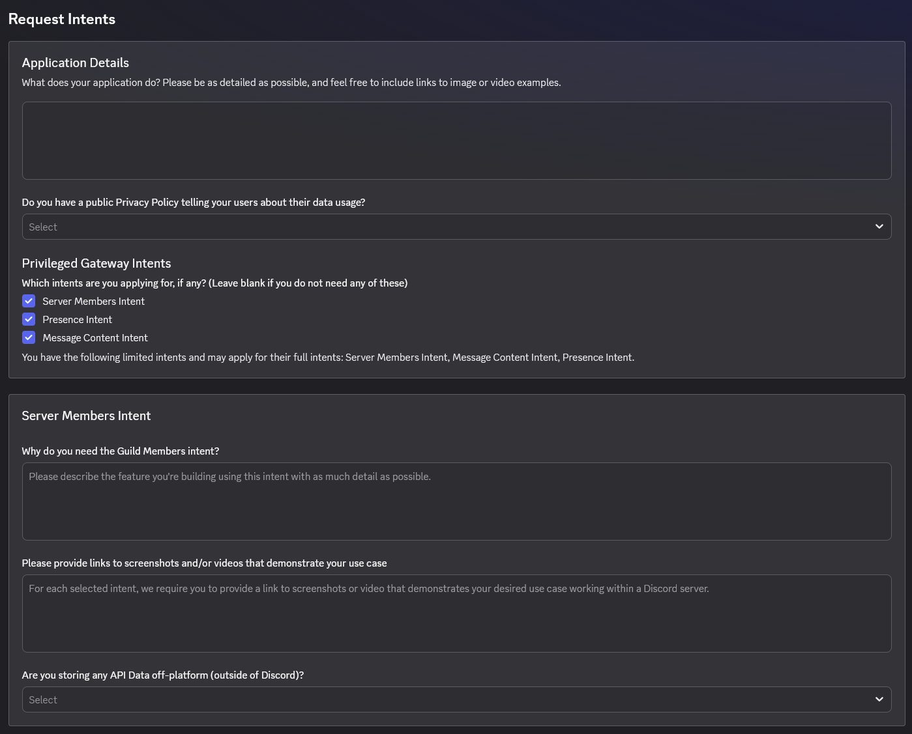
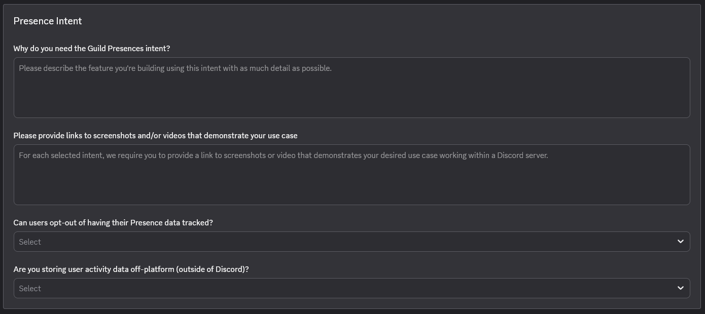
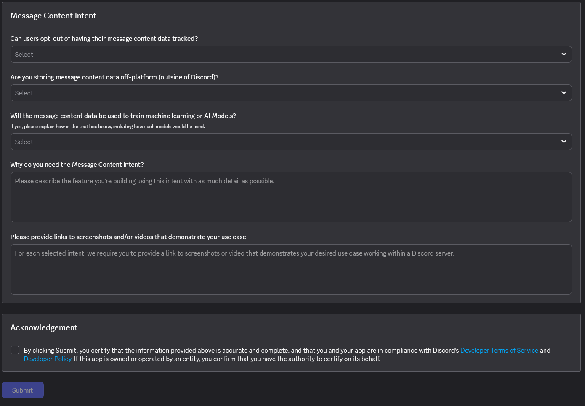

# Discord Intents Review Process


This process does not apply to a majority of Modmail user's. The only time a Modmail bot will need to go through Discord's Intent Review Process is in one of the following two cases:
1. *(for bots in only one server):* If the server your bot is in is close to, or above 10,000 members.
2. *(for bots in multiple servers):* If the combined member count of all the servers your bot is in is close to, or above 10,000 members.


## Background

Discord uses Gateway Intents to control what information is sent to your bot. Some intents, including **Message Content**, **Server Members**, and **Presence**, are considered **Privileged Intents** because they provide access to data that Discord considers more sensitive from a privacy and security perspective. Discord limits access to these intents to ensure developers only collect the information necessary for their bot's functionality.

Modmail requires the **Message Content Intent** to read user messages and create tickets, and the **Server Members Intent** for user information features. Discord now determines privileged intent review eligibility based on the **total number of users your bot can access**, rather than the number of servers your bot is in. Applications with access to 10,000 or more users must complete Discord's intent review process before using privileged intents. During review, Discord will ask why your bot needs the requested intents and how the data is used.


## Intents Request Form

<figure><figcaption><p>Intents Application Form for Application Details and Server (Guild) Members Intent</p></figcaption></figure>
<figure><figcaption><p>Questions for Prescence Intent (<strong>Not Required</strong> for Modmail.)</p></figcaption></figure>
<figure><figcaption><p>Questions for Message Content Intent and Certification of Answers</p></figcaption></figure>

## Suggested Responses

### Application Details

> *Q: What does your application do? Please be as detailed as possible...*



```
Modmail is a shared inbox bot for server moderation. When a user sends a Direct Message to the bot, it automatically creates a dedicated text channel (a "thread") within a designated staff category in our Discord server. Server staff can read the user's messages in this channel and reply using bot commands. The bot then relays these staff replies back to the user via Direct Message. This allows for organized, private, and collaborative support between users and the moderation team.
```




You will need to adopt a privacy policy for your bot. We have a version you can opt to use [here](../faq/privacy-policy.md).



Whether you use our template privacy policy, or another privacy policy of your choosing, it is a legally binding committment between you, and the users who use your bot in most jusrisdictions. Failing to comply with the guidlines, expectations, and promises made in a privacy policy is not only a gross breach of trust, but in some jusrisdictions, illegal, or at a minimum, subject to civil liability.

It is imperative that before adopting any privacy policy you review it personally, and with your team, and continue to review it with new team members as they join your team. As the operator of the bot, you are responsible for ensuring that everyone on your team is compliant with the chosen privacy policy.


> *Q: Do you have a public Privacy Policy telling your users about their data usage?*


```
Select: Yes
```




You'll need to add a link to your bots Privacy Policy to its Bio field via the [Discord Developer Portal](https://discord.com/developers/applications). *The **Description** field on the **General Information** is the text displayed in your bots Bio field.*


> *Q: Where is your Privacy Policy available?*


```
The bot has a link to the Privacy Policy in its Bio. As the interaction with the bot occurs via DMs, it is likely that users will see the bot's profile with the Privacy Policy link.
```




Only use the Privacy Policy link below if you have chosen to file our published generic privacy policy for bots. If you choose to implement your own, or use the template we provide at the bottom of that page, then you must link that policy instead.



> *Q: Please share a link to your Privacy Policy.*


```
https://docs.modmail.dev/frequently-asked-questions/privacy-policy
```



### Server Members Intent

> *Q: Why do you need the Server Members intent?*



```
Modmail requires the Server Members Intent to accurately check a user's membership status. 

When a user initiates a Direct Message with the bot, the bot must scan the user's shared servers to route the message to the correct server's staff team. Additionally, the bot uses member data to verify staff permissions, ensuring that only authorized moderators can view the modmail threads, use staff commands, and reply to users. 

Finally, tracking member leave events is necessary to immediately detect if a user has left the server, informing the moderation team whether replying to the individual is still possible.

```



> *Q: Please provide links to screenshots and/or videos that demonstrate your use case*



```
https://youtu.be/wkLv6_PsmHQ
```




Our team is aware that this video does not meet our usual requirements for a polished final result. Once we have additional time, and verification that the details in this video are sufficient, we will release a more polished version to be used in the future.

If you want to record a video using your own bot, you are welcome to do so.




> *Q: Are you storing any API Data off-platform (outside of Discord)?*



```
Select: Yes
```



> *Q: Are you storing API Data for 30 days or less?*


```
Select: No
```


> *Q: How do users contact you to request deletion of their activity data?*


```
Users can request the deletion of their data by sending a Direct Message to the bot itself to contact the server staff, or by directly messaging one of the server administrators. This information is also contained in the bot's privacy policy.
```


> *Q: Are you encrypting the data that you store at rest, as is required by our developer policy?*


```
Select: Yes
```


### Message Content Intent

> *Q: Can users opt-out of having their message content data tracked?*


```
Select: Yes
```


> *Q: Are you storing message content data off-platform (outside of Discord)?*


```
Select: Yes
```


> *Q: Are you storing user message content data for 30 days or less?*


```
Select: No
```



In almost all cases the answer to the question above (#3) will be No. However, if you have set your log retention period via the config command to 30 days or less, than your answer would be **Yes** instead.


> *Q: How do users contact you to request deletion of their activity data?*


```
Users can request the deletion of their data by sending a Direct Message to the bot itself to contact the server staff, or by directly messaging one of the server administrators. This information is also contained in the bot's privacy policy.
```


> Q: Are you encrypting the data that you store at rest, as is required by our developer policy?


```
Select: Yes
```


> Q: Will the message content data be used to train machine learning or AI Models?


```
Select: No
```



This may be different for your use case. If you currently, or intend in the future to; use the data Modmail collects for AI training purposes, you would need to select `Yes` for this question.



> Q: Why do you need the Message Content intent?


```
The core functionality of Modmail relies on processing, relaying, and logging message content sent within the server's moderation channels. The bot requires the Message Content intent to read the messages sent by staff members inside the server's modmail threads, allowing the bot to forward those replies back to the user. Additionally, the intent is necessary to monitor and log internal staff-only discussions within these server channels to preserve a complete and accurate moderation history for future reference. Without the Message Content intent, the bot cannot detect staff replies or archive internal server logs, rendering the moderation workflow non-functional.
```


> Q: Please provide links to screenshots and/or videos that demonstrate your use case


```
https://youtu.be/wkLv6_PsmHQ
```


### Presence Intent

<details>

<summary>Presence Intent</summary>

While we often recommend the Presence intent to allow for compatibility with a number of third party plugins, it is not a requirement for the core bot.

Our current stance as a team is that if a plugin requires the presence intent, then the plugin developer is responsible for providing an articulatable reason to users to use during the intents review process.

If they require assistance with this, they can contact the Modmail bot in our official [support server](https://discord.gg/cnUpwrnpYb).

</details>