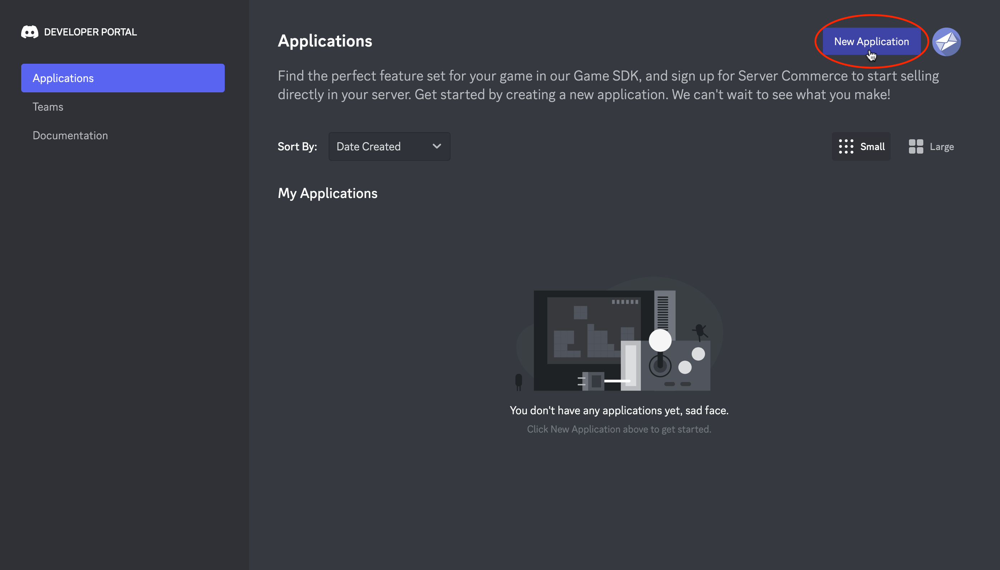
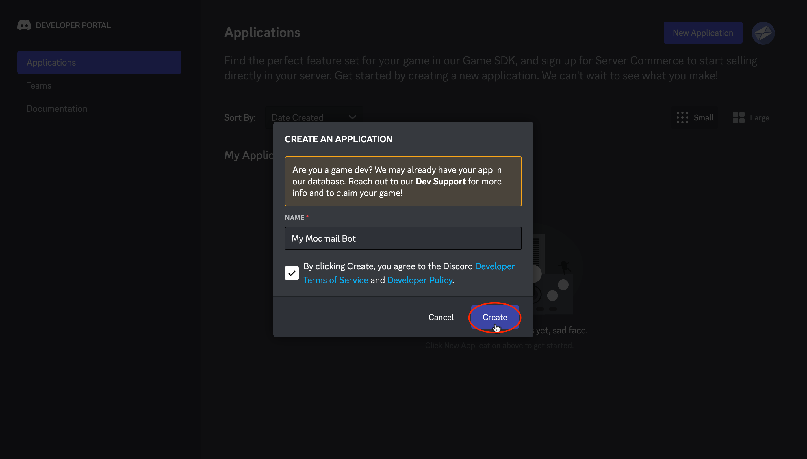
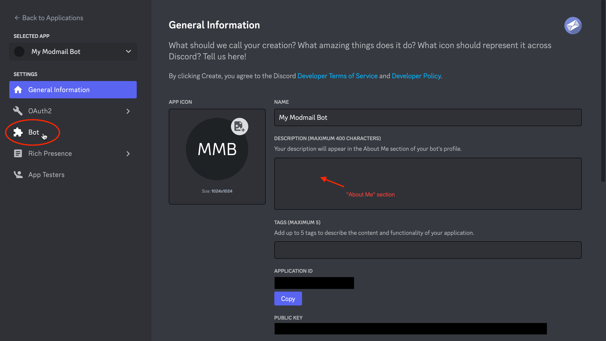
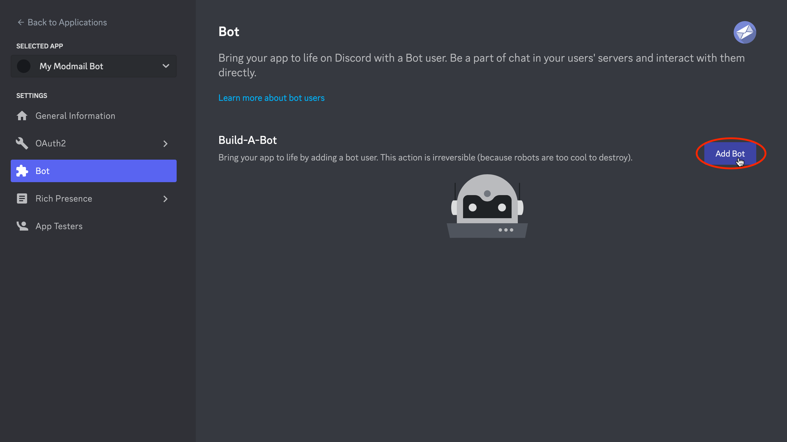
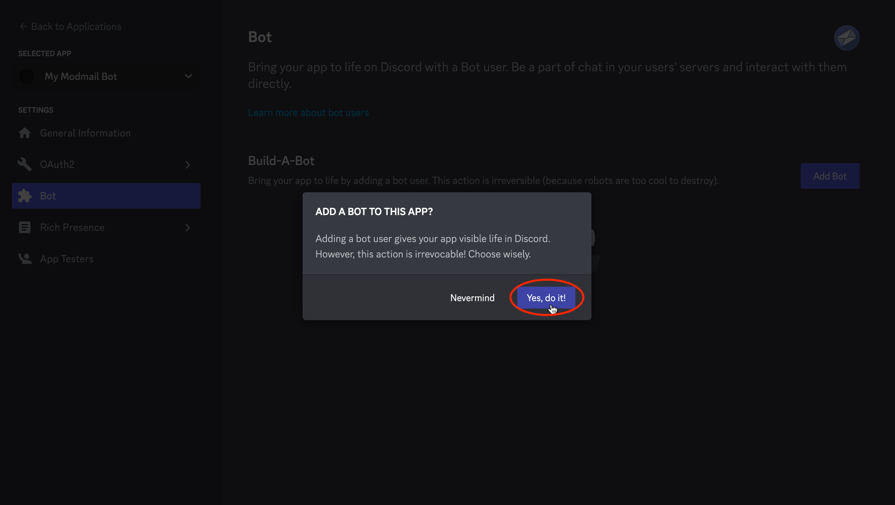
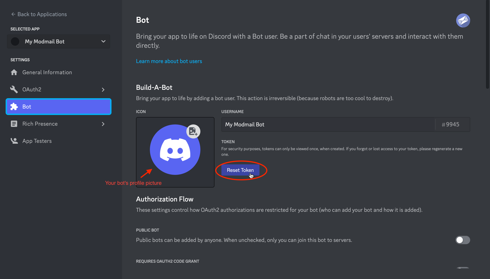
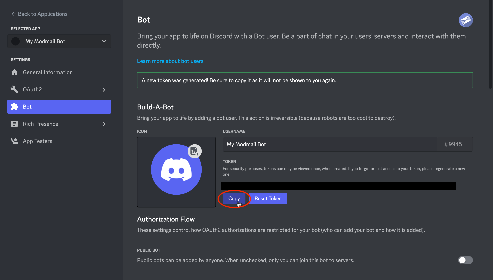
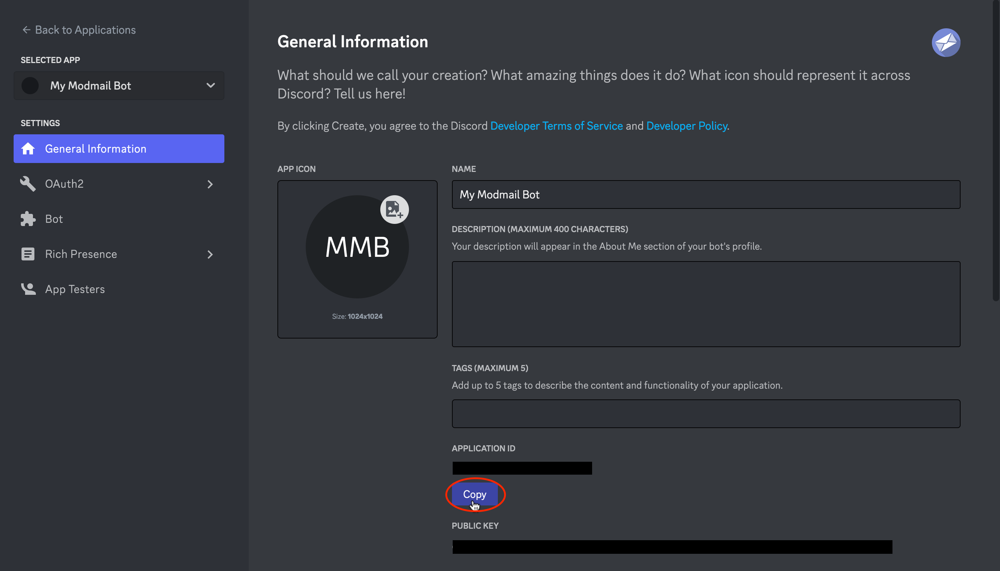
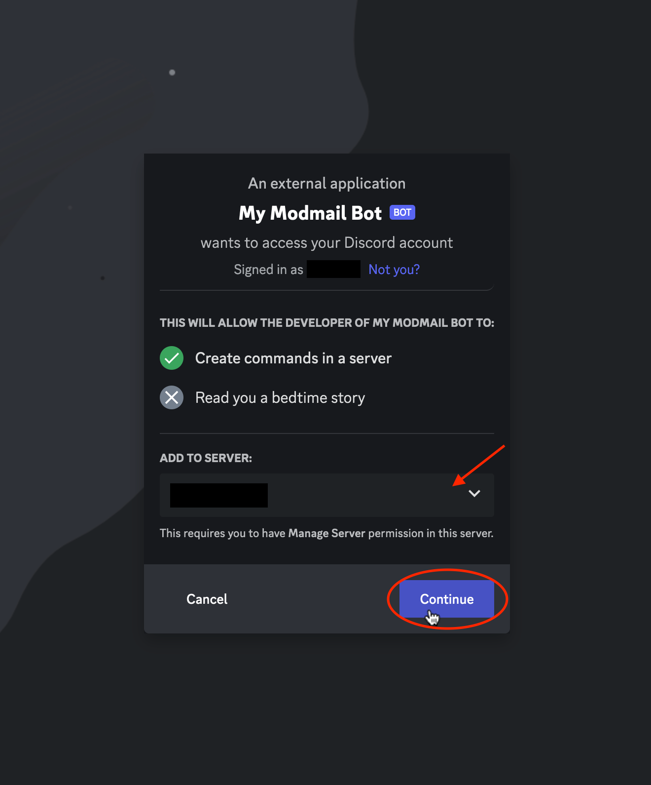
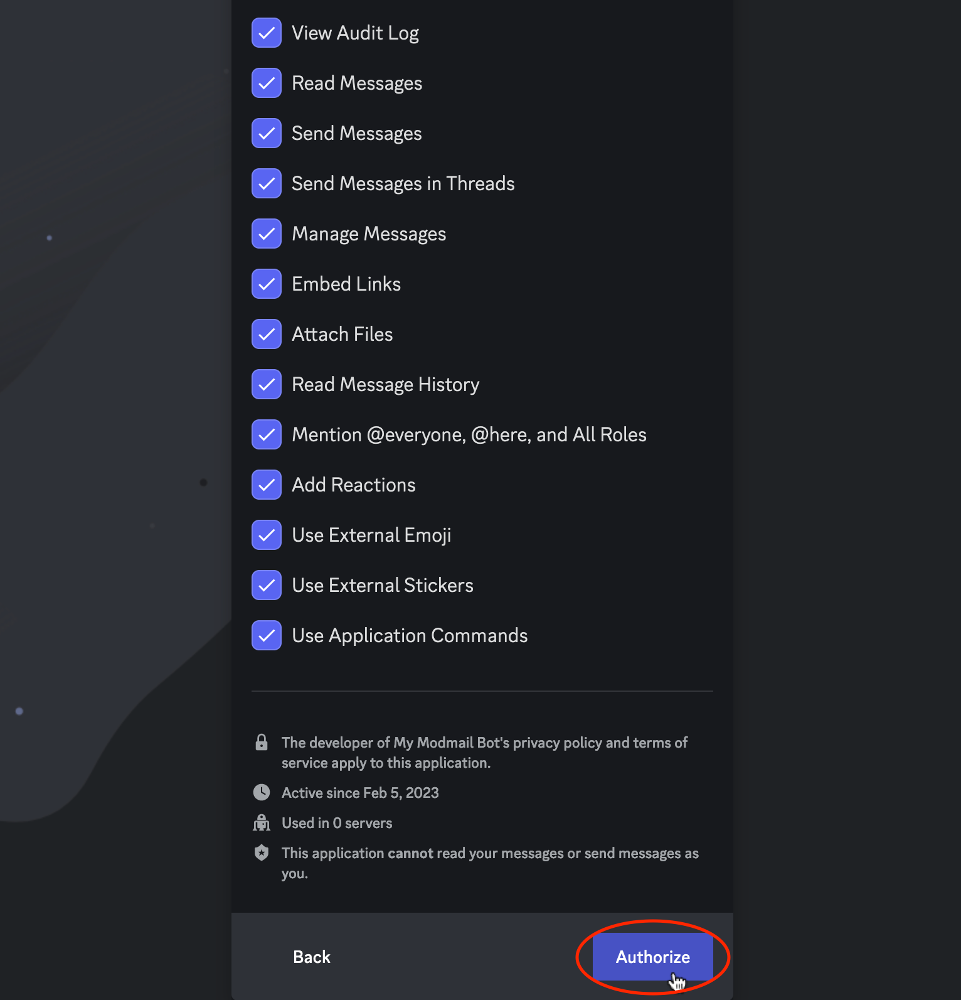

# Installation

Modmail is a self-hosted bot. This unfortunately means that there's **no** public bot invite. Furthermore, due to the inner workings of the bot and its highly customisable interfaces, you will need to host your own dedicated Modmail bot.&#x20;

This section provides setup instructions for Modmail on many hosting methods, both **free and paid**.

Here are the basic requirements for hosting your Modmail bot. You will find instructions on obtaining and using them in later sections.

*   A Discord account.

    You will need to create a Discord bot under your account.
*   A MongoDB instance.

    Modmail will store its internal data to this database.
*   A hosting server.

    To keep Modmail running 24/7 in your server.


**Note:** There are two components for Modmail: the bot component and the Logviewer component. You will need **both** to take full advantage of Modmail.


## Create a Discord bot

Regardless how you choose to host your Modmail bot, you first will need to create a Discord bot.&#x20;

Head over to the [**Discord Developer Portal**](https://discordapp.com/developers/applications/) and create a new application.

<div>

<figure><figcaption><p>Click <strong>New Application</strong> from the homepage.</p></figcaption></figure>

 

<figure><figcaption><p>Choose a name for your bot, then click <strong>Create</strong>.</p></figcaption></figure>

</div>

Once you created a new application, head over to the **Bot** tab and create a new bot.

<figure><figcaption><p>Navigate to the <strong>Bot</strong> tab on the sidebar. On this page, you can also edit the <em>About Me</em> section of your bot.</p></figcaption></figure>

<div>

<figure><figcaption><p>Click <strong>Add bot</strong> to create the bot.</p></figcaption></figure>

 

<figure><figcaption><p>Click <strong>Yes, do it!</strong> to confirm your choice.</p></figcaption></figure>

</div>

After adding a bot, reset the token, then copy and store the newly generated token somewhere for later.

<div>

<figure><figcaption><p>Click on <strong>Reset Token</strong> then confirm with <strong>Yes, do it!</strong> Here you can also set your bot's profile picture.</p></figcaption></figure>

 

<figure><figcaption><p>Click <strong>Copy</strong> then store the copied token somewhere safe for later steps.</p></figcaption></figure>

</div>


**Make sure to keep this token private!** Anyone who has this token can control (or "hack") your bot and potentially cause malicious damage. If you feel that your token has been leaked, click on **Reset Token** immediately to invalidate the old token and generate a new one. Don't forget to also update your Modmail configs with your new token.


Next, we need to change some bot settings. Toggle **off** _public bot_, then toggle **on** both _server members intent_ **and** _message content intent_. Remember to click on **Save Changes**.

<figure><figcaption><p>Toggle off <strong>public bot</strong>, toggle on <strong>server members intent</strong>, and toggle on <strong>message content intent</strong>. Afterwards, click <strong>Save Changes</strong> to apply the changes. Your on/off toggles should appear similar to this screenshot.</p></figcaption></figure>

<details>

<summary>Why do I need to do this?</summary>

Disabling _public bot_ prevents other users from inviting your bot. Your bot may not behave appropriately if it's present in other servers.

Enabling _server members intent_ allows Modmail to view your server's members list and efficiently populate the bot's internal cache.

Enabling _message content intent_ allows bot commands to function since Modmail doesn't use slash commands.

What about _presence intent_? It is not needed for Modmail, but it may be required for specialized plugins. We recommend keeping this toggled off to save computational resources.

</details>

### Inviting the bot

Navigate back to the **General Information** tab and copy the application ID.

<figure><figcaption><p>Click <strong>Copy</strong> to copy the application ID. This is also known as your "Bot ID".</p></figcaption></figure>

Using the following URL as template, replace `YOUR-ID-HERE` with the ID you just copied. Do not change anything else! Open a new browser tab and go to that URL.&#x20;


```
https://discord.com/oauth2/authorize?scope=bot&permissions=416075476184&client_id=YOUR-ID-HERE
```


Discord should prompt you to choose a server to invite your bot, followed by a list of permissions. Scroll to the bottom and click **Authorize**.&#x20;

<div>

<figure><figcaption><p>Choose your server to invite, then click <strong>Continue</strong>.</p></figcaption></figure>

 

<figure><figcaption><p>Scroll to the bottom and click <strong>Authorize</strong>. Don't un-check any permissions. Only Administrator is optional.</p></figcaption></figure>

</div>


You **must leave on** all permissions excepted _Administrator_ (optional)! However, we recommend allowing _Administrator_ for ease of setup and avoid complications with Discord permissions.


Your bot should now be **offline** in your server. Congratulations, that's as excepted! You have successfully created a Discord bot. The [next steps](./#next-steps) will guide you on starting up your Modmail bot.

## Next steps

Click on one of the links below to view further instructions for your preferred hosting method.

### [Railway](railway.md) (free)

A platform as a service (PaaS) that offers a generous free plan, which allows you to host Modmail for free without any downtime. A credit card is required for verification purposes.[ **Go to guide ►**](railway.md)****

### [Local Hosting](local-hosting-vps/) (free)

Do you have an old PC, a Raspberry Pi, or a Linux box that you're able to keep online 24/7?&#x20;

You can host Modmail on it for free (electricity fees may apply).[ **Go to guide ►**](local-hosting-vps/)****

### [Modmail Patreon](https://www.patreon.com/kyber) (paid)

We offer paid hosting solution for your Modmail bot. Hosting Modmail with us costs $4-5 USD per month.&#x20;

We will also fully manage your bot hosting for you, so you don't need to worry about upgrading or setting up your own host server. [ **Go to Patreon page ►**](https://www.patreon.com/kyber)****

### [Heroku](heroku.md) (paid)

Another popular PaaS that's used to be free. However, their recent pricing adjustments, it now costs $5-7 USD per month.&#x20;

If you are currently a higher-education student, you may be eligible for the first year free with their [student offer](https://www.heroku.com/github-students).[ **Go to guide ►**](heroku.md)****

### [Cloud Server / VPS](local-hosting-vps/) (paid)

Apart from [Patreon hosting](./#modmail-patreon-paid), hosting on a cloud server / VPS is the most reliable hosting method. Rent a virtual server from any reputable hosting provider for roughly $4-10 USD per month (price varies), and you'll be able to install Modmail onto the server.

This method is a lot more "involved" than other solutions. If you're not comfortable with configuring remote Linux environments, we recommend you to choose a different option. [ **Go to guide ►**](local-hosting-vps/)****

### [Replit](replit.md) (free/paid)

> The Modmail team does not recommend this hosting method.

An online code execution environment. You can host Modmail there for free using certain exploits. The legitimate method costs $7 USD per month. However, regardless if you pay or host for free, hosting on Replit are often unstable. [ **Go to guide ►**](replit.md)****


