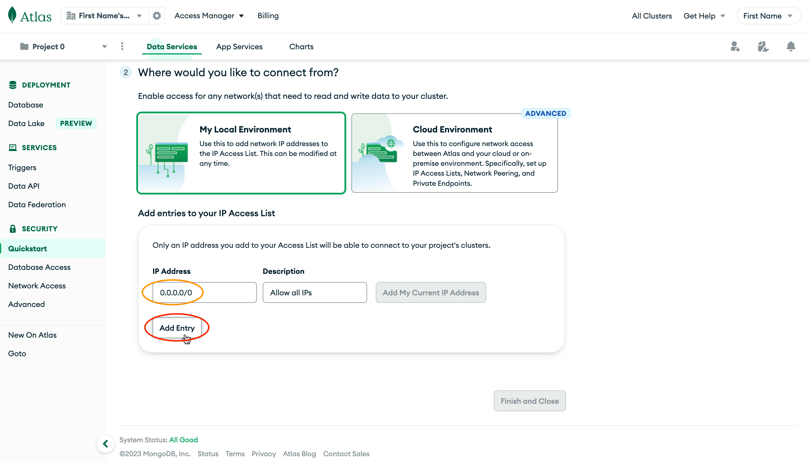
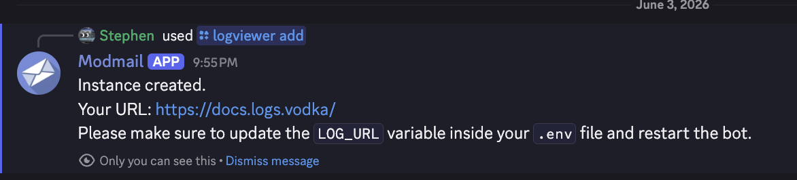
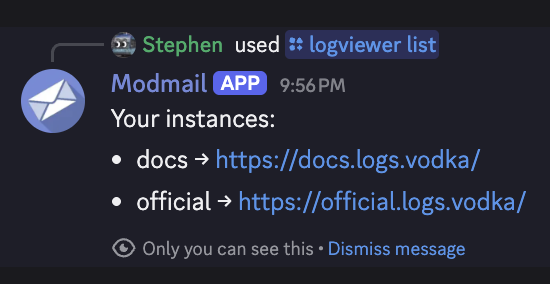
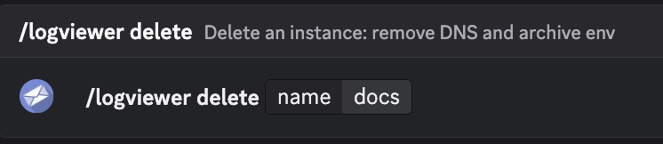
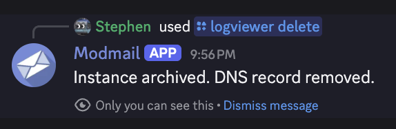

# Free Logviewer Hosting from Lorenzo

[Lorenzo](https://lvh.lol), a long time contributor, supporter, and administrator in our community provides a free logviewer hosting service at this own expense to members of the Modmail community. Hosting using this service is facilitated through the Modmail project's official Discord server, which you can join [here](https://discord.gg/cnUpwrnpYb).

## Limitations
* You can only host three free logviewers with this service. Using secondary accounts, or other methods to bypass this limit may result in permanent restriction from the service. Please do not take abuse Lorenzo's selfless generosity. (He is providing this completely at his own expense.)
    * If you wish to host additional logviewers with this service, DM our Modmail and you may be able to work out a deal at Lorenzo's discussion.
* Logviewers hosted can only be subdomains of the `logs.vodka` domain. (Ex: `[yourlogviewenamehere].logs.vodka`).

## Requirements
* Join our Discord Server
* Host your MongoDB connection URI using MongoDB Atlas (locally hosted databases are not supported).
* Set your MongoDB database Network Security to be accessible from anywhere. *See an excerpt of our [installation guide](./README.md) below if you did not do this during installation.)

Allow Database Access from Anywhere

<figure><figcaption>
Set IP Address to <strong>0.0.0.0/0</strong>, then click <strong>Add Entry</strong>.
</figcaption></figure>

## Setup Steps



Have your MongoDB URI ready to go, you can use the same database account you used for your bot. Take a look at your `.env` file or enviornment variables if you don't have yours handy.


Choose the name you'd like for your logviewer, most people use a version of their server name.


Run this command

``/logviewer add [name] [mongouri]``


It is really that simple, your Logviewer is now ready to go.



It may take a few minutes before you are able to visit the newly deployed logviewer for a variety of reasons beyond Lorenzo, the Modmail team, or your control. If you can't access it right away wait 5-10 minutes, clear your browser cache, and try again.

While unusual, depending on the settings for your computer and network, it could take up to an hour, be patient and it should work itself out behind the scenes.





## Viewing Your Logviewers



If you forget how many, or what logviewers you have created with the service, you can use this command to see what they are:

``/logviewer list`` 




## Deleting a Logviewer



To delete your logviewer at any time, you can use this command:

``/logviewer delete [name]`` 


If for any reason you want to rename your logviewer, the easiest way to do this would be to delete it, and then create it again with a new name while using the same MongoDB URI.





Version History



## Initial Creation

Initial creation of docs page for using the Free Logviewer Hosting from Lorenzo.



