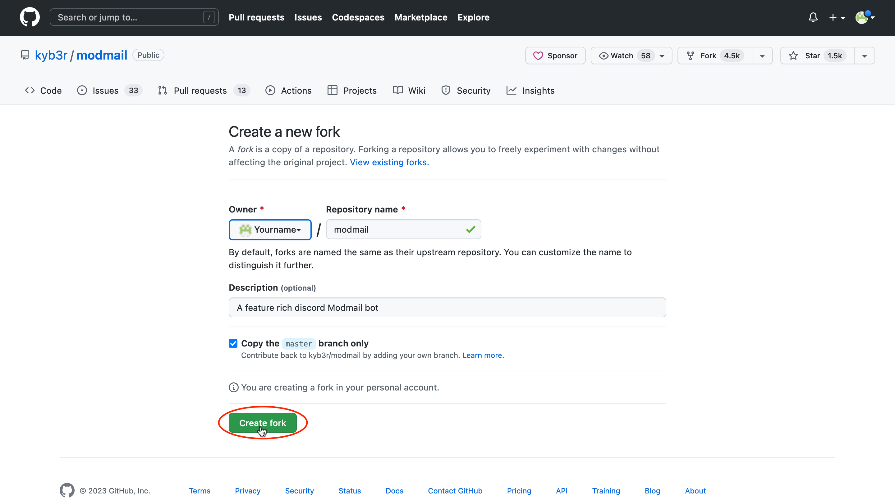
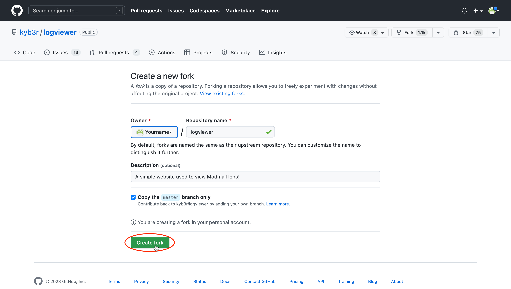
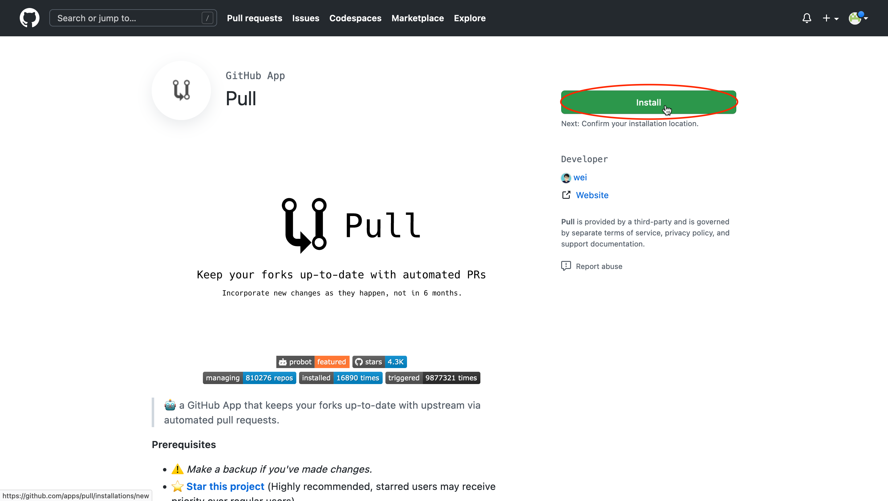
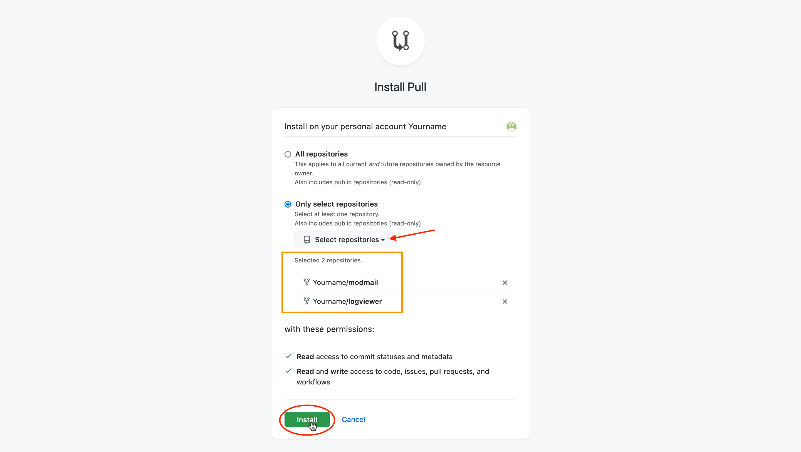

# Heroku

### What is Heroku? 

Heroku is a container-based cloud Platform as a Service (PaaS). Developers use Heroku to deploy, manage, and scale modern apps.

### Requirements 

* A credit card (for payment and verification).
* An email account.
* A [GitHub](https://github.com/signup) account.
* You have completed the initial steps: [invited your bot](./#create-a-discord-bot) and [created a MongoDB database](./#create-a-mongodb-database).

### Costs

Unfortunately, Heroku is no longer free-of-charge. You will need at least their Eco plan, which currently costs $5 USD per month. See their [pricing page](https://www.heroku.com/pricing) for more info and up-to-date prices.

If you are a higher-education student, you *may* be eligible for their [student offer](https://www.heroku.com/github-students), which grants you $13 USD of credits per month for 24 months—enough to host Modmail free for two years.


The Basic Setup option below uses templates from our repository, while this is a simpler way to setup the bot, it is no longer recommended due to added complexities in the updating process.

It is recommended you use the complex setup, which allows for seamless autoupdate of your Modmail instance.








## Fork our GitHub repositories

You will need to fork our repositories to deploy onto Heroku.

Make sure you're logged in to [GitHub](https://github.com/). You will need to fork **two** repositories.&#x20;

First we fork the Modmail repository. Head over to [https://github.com/modmail-dev/modmail/fork](https://github.com/modmail-dev/modmail/fork), leave all the settings as default, and click **Create fork**.

<figure><figcaption>
Create a GitHub fork for the Modmail Repository.
</figcaption></figure>

Next do the same for the Logviewer repository by heading over to [https://github.com/modmail-dev/logviewer/fork](https://github.com/modmail-dev/logviewer/fork), leave all the settings as default, and click **Create fork**.

<figure><figcaption>
Create a GitHub fork for the Logviewer Repository.
</figcaption></figure>

Next, to keep your Modmail and Logviewer up to date, you will need to install the [Pull App](https://github.com/apps/pull). Simply head over to [https://github.com/apps/pull](https://github.com/apps/pull), click **Install**, choose **Only select repositories**, then select **both** the Modmail and Logviewer repositories that you forked in the previous step.&#x20;

<figure><figcaption>
Click <strong>Install</strong> to install the <a href="https://github.com/apps/pull">Pull app</a>.
</figcaption></figure>

 

<figure><figcaption>
Select <strong>both</strong> the Modmail and Logviewer forks, then click <strong>Install</strong>.
</figcaption></figure>

Your GitHub should now be all set. Next step, [create a Heroku account](https://heroku.com) on their website to deploy your bot.


## Deploying the Log Viewer

Go to this link: ``https://heroku.com/deploy?template=https://github.com/[YOUR GITHUB USERNAME HERE!!!]/logviewer``

*Fill in your Github username `[YOUR GITHUB USERNAME HERE!!!]` before pressing enter!*

**This is not the bot!**

Choose a name for your app and paste your Mongo URI in the field (from your notepad). After you click the `Deploy App` button, it will start creating the website.

After that's done configuring, click the `View` button. It will redirect you to the logviewer home screen. Copy the link in the address bar and paste it in Notepad.



## Deploying Modmail

**This is the second application you will be deploying - this is the actual bot.**

Go to this link: ``https://heroku.com/deploy?template=https://github.com/[YOUR GITHUB USERNAME HERE!!!]/modmail``

*Fill in your Github username `[YOUR GITHUB USERNAME HERE!!!]` before pressing enter!*

**01.** Choose any name for your app. Note: this name doesn't matter at all.

**02.** Put your bot's token in the `TOKEN` field.

**03.** In the `DATABASE_TYPE` You may fillout: `mongodb`

**04.** Put the ID of your Server into the `GUILD_ID` field.

**05.** Put your own ID in the `OWNERS` field. If there are multiple owners, separate them by a comma.

**06.** Put your Mongo connection URI from the previous section in the `CONNECTION_URI` field.

**07.** Put the URL of your log viewer Heroku app (`https://yourlogviewerappname.herokuapp.com`) in the `LOG_URL` field.

**08** Click the `Deploy App` button and wait for it to finish.

**09.** Click `Manage App` and go into the `Resources` tab, where you need to turn on the worker by clicking the pencil icon next to it.

**10.** If you want, you can go over and check the application logs to see if everything is running smoothly. If any unexpected errors pop up, join our [Discord server](https://discord.gg/cnUpwrnpYb) and DM Modmail. Our support team will gladly assist with any issues.

**11.** Once the bot is online in your server, make sure to give it the required positions from [Installation](https://docs.modmail.dev/installation).

**12.** Run the `?setup` command and you are good to go!


## Updating

You can update Modmail on your Heroku account whenever changes are made to the repository. Link your GitHub Account to Heroku:

**One Time Update:** You then want to go to your modmail application in Heroku, connect your modmail fork via the `Deploy` tab and deploy the `master` branch.

**Automatic Updates:** You can turn on auto-deploy for the master branch if you don't want to go through the process of logging into Heroku and deploying the branch every time changes to the repo are made in the future.





 


## Deploying the Log Viewer

### **Click the button below to deploy the logviewer to Heroku!**

**This is not the bot!**

You will need to deploy a separate log viewer application from [this repository](https://github.com/modmail-dev/logviewer). This Heroku application is separate from the bot; it's a simple website that will be used to display your thread logs.

Choose a name for your app and paste your Mongo URI (from your notepad). After you click the `Deploy App` button, it will start creating the website.

After that's done configuring, click the `View` button. It will redirect you to the logviewer home screen. Copy the link in the address bar and paste it in Notepad.



## Deploying Modmail

### **Click the button below to deploy the bot to heroku.**

**This is the second application you will be deploying - this is the actual bot.**

**1.** Choose any name for your app. Note: this name doesn't matter at all.

**2.** Put your bot's token in the `TOKEN` field.

**3.** In the `DATABASE_TYPE` You may fillout: `mongodb`

**4.** Put the ID of your Server into the `GUILD_ID` field.

**5.** Put your own ID in the `OWNERS` field. If there are multiple owners, separate them by a comma.

**6.** Put your Mongo connection URI from the previous section in the `CONNECTION_URI` field.

**7.** Put the URL of your log viewer Heroku app (`https://yourlogviewerappname.herokuapp.com`) in the `LOG_URL` field.

**8** Click the `Deploy App` button and wait for it to finish.

**9.** Click `Manage App` and go into the `Resources` tab, where you need to turn on the worker by clicking the pencil icon next to it.

**10.** If you want, you can go over and check the application logs to see if everything is running smoothly. If any unexpected errors pop up, join our [Discord server](https://discord.gg/cnUpwrnpYb) and DM Modmail. Our support team will gladly assist with any issues.

**11.** Once the bot is online in your server, make sure to give it the required positions from [Installation](https://docs.modmail.dev/installation).

**12.** Run the `?setup` command and you are good to go!

***



 

