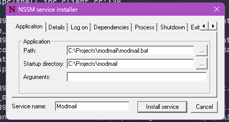

# Ubuntu

## Prerequisites

* Root access (**`sudo`**).
* Minimum 1GB of RAM
* At least 2GB available disk space.
* Supported releases: Ubuntu 18.04 LTS, Ubuntu 20.04 LTS, Ubuntu 22.04 LTS.

## Dependencies

We will be using the following dependencies:

* Python 3.10
* Tools: `git`, `wget`, `software-properties-common`
* Additional Modmail requirements: `libcairo2-dev`, `libffi-dev`, `g++`

To install these dependencies, we will be using the **`apt`**.


All code blocks should be executed in bash and line by line unless specified otherwise.


We recommend adding the `deadsnakes` ppa to install Python 3.10:

```bash
sudo apt update
sudo apt -y install software-properties-common
sudo add-apt-repository -y ppa:deadsnakes/ppa
```

Now install the pre-requirements with `apt`, you can copy and run these 3 lines at once:

```bash
sudo apt -y install python3.10 python3.10-dev python3.10-venv python3-pip \
                    libcairo2-dev libffi-dev g++ \
                    git wget nano
```

<details>

<summary>Failed to install Python 3.10?</summary>

You can manually compile Python instead of adding using the Deadsnakes PPA. Compiling Python may take a while (est. 5-10 minutes).

```bash
sudo apt update && sudo apt upgrade -y  # Update and upgrade all packages
sudo apt install -y software-properties-common \
                    libcairo2-dev libffi-dev g++ \
                    git wget nginx \
                    build-essential zlib1g-dev libncurses5-dev \
                    libgdbm-dev libnss3-dev libssl-dev \
                    libreadline-dev libffi-dev libsqlite3-dev libbz2-dev
wget https://www.python.org/ftp/python/3.10.9/Python-3.10.9.tgz
tar xzf Python-3.10.9.tgz
cd Python-3.10.9
./configure --enable-optimizations 
make altinstall
```

</details>

## Installing Bot

Clone and cd into the official Modmail repository with:

```bash
git clone https://github.com/modmail-dev/modmail
cd modmail
```

Inside the Modmail folder, Install pipenv and the bot dependencies with:

```bash
pip install pipenv
pipenv install
```

Create a file named `.env` with `nano` and paste all the environmental variables (secrets) needed to run the bot via right-clicking in the nano editor.

```bash
nano .env
```

<figure><figcaption></figcaption></figure>

After that, press `Ctrl+O` and `Enter` to save your changes. Exit the `nano` editor with `Ctrl+X`.

You can now go ahead and try running your bot with:

```bash
pipenv run bot
```

If no error shows up, it means your bot is now running correctly.

## Setting up auto-restart

To have the bot auto-restart on crash or system reboot, we will be using systemd by making a service file for our bot.

In order to create the service file, you will first need to know three things, your Linux `username`, your Modmail repository `path` and your Pipenv `path`.

First, your Linux `username` can be fetched with the following command:

```bash
whoami
```

If you have cloned the Modmail repo as a `root` user, your Modmail repo path should be:

```bash
/root/modmail
```

Otherwise, your path should be:

```bash
/home/$USER/modmail/
```

You can get your Pipenv `path` with:

```
whereis pipenv
```

Now, using `nano`, create a service file for systemd with:

```bash
sudo nano /etc/systemd/system/modmail.service
```

and paste in the contents below, replacing `username`, `modmail_path` and `pipenv_path` with yours respectively. `Ctrl+O` and `Enter` to save. `Ctrl+X` to exit the nano editor.

```bash
[Unit]
Description=Modmail bot
After=network.target

[Service]
User=username # replace this
Group=username # replace this
Restart=always
RestartSec=10
Type=simple
WorkingDirectory=modmail_path # replace this
ExecStart=pipenv_path run python bot.py # replace pipenv_path only

[Install]
WantedBy=multi-user.target
```

Now, start your Modmail bot with:

```bash
sudo systemctl start modmail
```

If everything goes correctly, you should see your bot online. You can also view the logs of your systemd process with:

```bash
sudo journalctl -eu modmail
```

With that said, go ahead and enable your Modmail service to auto-restart after crash and reboot with:

```bash
sudo systemctl enable modmail
```

If in the future you need to stop and disable your Modmail service, you can do so with:

```bash
sudo systemctl stop modmail
sudo systemctl disable modmail
```

## Updating

Your Modmail is set to auto-update itself by default, but you can also run the `?update` command on your bot manually, replacing `?` with your bot prefix.

If for some reason your update command isn't working correctly, you can update your bot by going into your modmail folder and pulling the latest changes from GitHub like so:

```bash
cd modmail && git pull
```

Be sure to restart your bot to apply the changes. If you followed the above instructions on setting up auto-restart, you can do so with:

```bash
sudo systemctl restart modmail
```
