# Modmail Panel Hosting

The Modmail Hosting Panel, or Modmail Panel is a custom software stack that is designed for doing one thing, hosting Modmail. Because of this, it has an intuitive user interface, and a number of features that allow for a simple hosting experience. While similar in concept to systems like Pterodactyl, instead of trying to shoehorn a Discord bot into a game hosting platform, the platform starts Modmail first.

Currently, there are only two hosting options that use the Modmail Panel:

Modmail Team Hosting

We offer paid hosting solution for your Modmail bot. We will also fully manage your bot hosting for you, so you don't need to worry about upgrading or setting up your own host server. Refer to our [BMAC Hosting here](https://buymeacoffee.com/modmaildev/membership).

Prices start at $4 per month.

modmail.lvh.lol by Lorenzo

Run by a member of our community and team, this is the birthplace of the Modmail panel. *The Modmail Team does not necessarily endorse this hosting provider.*

Check it out at [modmail.lvh.lol](https://modmail.lvh.lol).

Prices start at $1.50 per month.

## Requirements
* Before setting up your bot on the Modmail Panel, you'll need to have all the elements we discuss in our [Installation Guide](/README.md):
    * Discord Bot Token
    * MongoDB Connection URI
    * Server ID
    * Logviewer URL
    * Bot Owner ID(s)

## Setup


For the purpose of this tutorial, the screenshots were taken on [modmail.lvh.lol](https://modmail.lvh.lol), however, if you are a Patreon or Buy Me a Coffee (BMAC) supporter, your process will be identical, but on our internal Modmail Panel. You can find the link in the Modmail Lounge server.





Login to the Modmail Panel using your Discord Account. For Buy Me a Coffee subscribers, you'll need to enter your email to link your BMAC membership to your Discord account in our system.

<figure>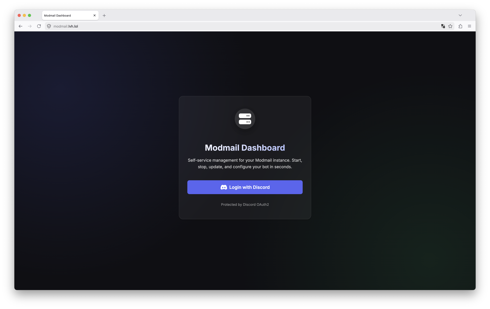<figcaption>
This is the Login page for the panel, press "Login with Discord" to get started.
</figcaption></figure>



Once you have logged in, and linked your BMAC account if necessary, you'll need to press **Create Instance** to open the creation screen.

<figure>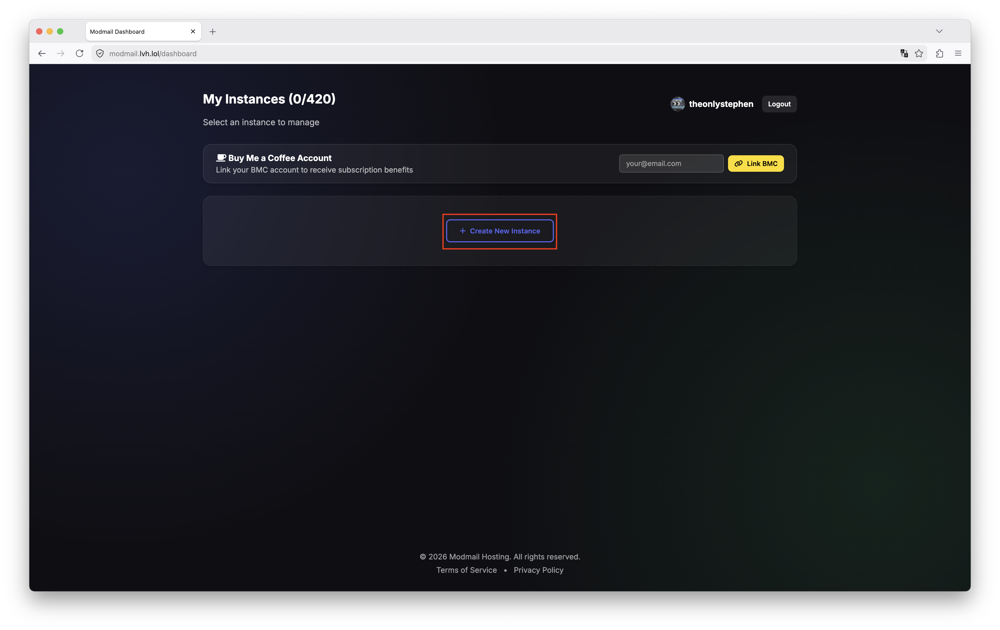<figcaption>
This is the homepage of the panel once you have logged in. Press <strong>Create Instance</strong> to begin.
</figcaption></figure>



Next, give your instance a friendly name, this can be anything, for most people, it makes sense to use your server's name.

Also on this screen enter your:
* Token
* Server ID
* Any additional Owner IDs (yours will be autofilled)
* Log URI
* MongoDB Connection URI

If you still need to get this information reference our [Installation Guide](/README.md) for step by step instructions. 

Once you have correctly entered these steps, press **Save Settings** and then confirm when prompted.

<figure>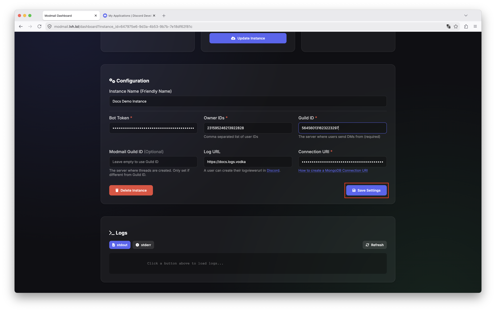<figcaption>
Enter the correct values into each of the fields shown, press the **Save Settings** box when completed.
</figcaption></figure>

<figure>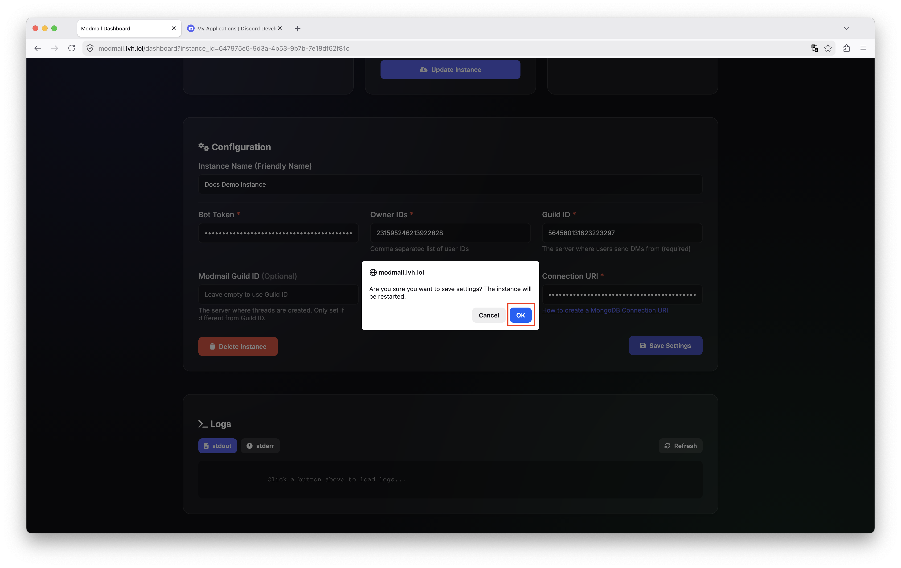<figcaption>
After saving settings, you will receive a confirmation prompt to ensure you wish to change your bot's values, press **Ok**.
</figcaption></figure>





For most users, it is recommended to leave the default selection of the **Master** branch with the **default** version.

If you have a reason to change this (such as needing experimental bug fixes in the Development branch), you can change this now, and then press the **Update Instance** button.


Once you have entered your bot's settings, press the green **Start** button to start the instance.

<figure>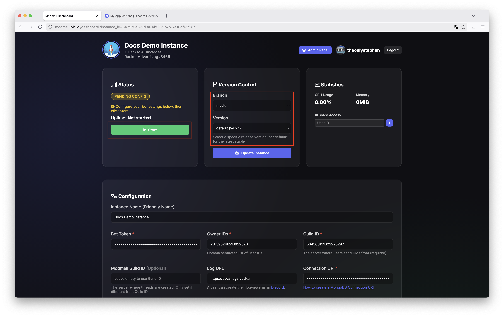<figcaption>
Press <strong>Start</strong> to boot up your instance for the first time.
</figcaption></figure>

<figure>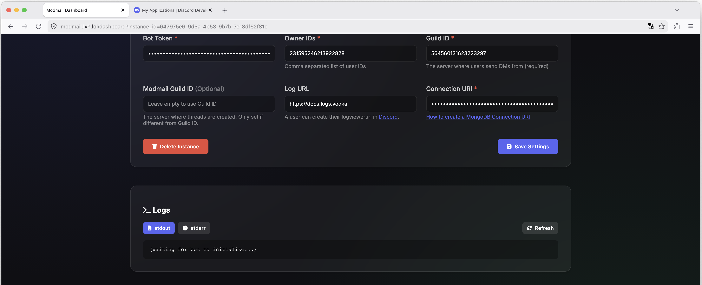<figcaption>
Below your bot's settings, you can see the logs of your bot at any time. During setup it will simply display "(Waiting for bot to initialize...)". If there are issues during setup they will display here when you press <strong>Refresh</strong>.
</figcaption></figure>




Within 2-3 minutes your bot should go online in your server.

If not...

If it does not come online within 2-3 minutes, press the **Refresh** button on the logs to see what went wrong.
<figure><figcaption>
Below your bot's settings, you can see the logs of your bot at any time. During setup it will simply display "(Waiting for bot to initialize...)". If there are issues during setup they will display here when you press <strong>Refresh</strong>.
</figcaption></figure>

<figure>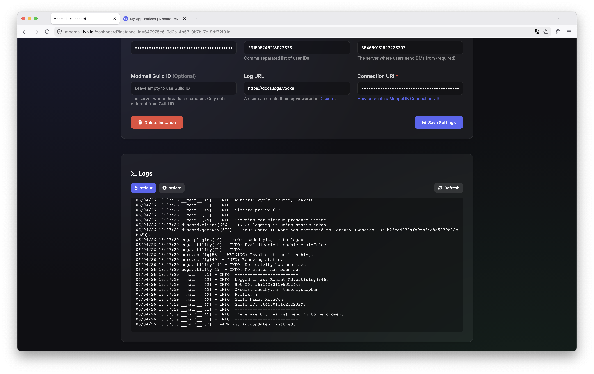<figcaption>
Your logs will look something similar to this once your setup is complete.
</figcaption></figure>

You can stop or restart your bot at any time using the **Stop** and **Restart** buttons at the top of the page.

<figure>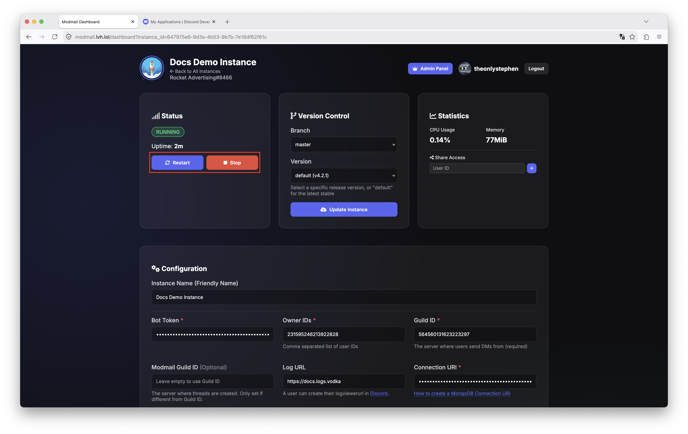</figure>


You have successfully deployed your Modmail bot using the Modmail Panel! You can now run `?setup` to get started. Take a look at our [usage guide](../usage-guide/README.md) if you need additional help.

*Note: as of the time of writing, on June 4th, 2026, the Modmail Panel does not support logviewer hosting, you'll need to handle this in other ways. For Patreon/BMAC supporters, contact the Modmail bot in the Modmail Lounge server for further assistance.*






## Sharing Access to your Modmail Instance

If you have a server co-owner, or top team member who may need access to restart your bot, view its logs, or change configuration variables, you can share access to your Modmail instance directly in the Modmail Panel.




Login to the Modmail Panel for your host and navigate to the bot you wish to share.

<figure><figcaption>
Each bot has its own sharing settings, so if you'd like to share multiple bots, you'll need to do one at a time.
</figcaption></figure>


On the right under **Statistics** there is a field to enter the Discord User ID of the user you wish to share access with. For more details on obtaining someone's User ID, check our this [Discord Support Article](https://support.discord.com/hc/en-us/articles/206346498-Where-can-I-find-my-User-Server-Message-ID).

You can share your Modmail instance with as many users as you would like, but, you'll need to add each User ID in one at a time.

<figure><figcaption>
Paste the user you wish to share access with in the field labeled <strong>User ID</strong> then press the <strong>+</strong> button.
</figcaption></figure>




You have now successfully shared access to your Modmail instance to another user. They can now login to the Modmail Panel using their Discord account and access your bot. Their access will look like this:

<figure>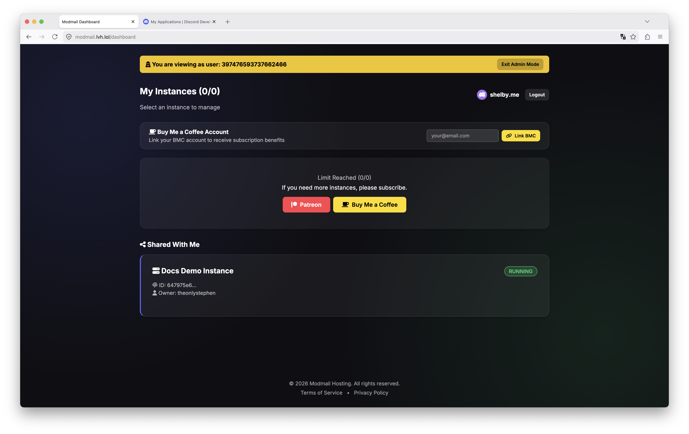<figcaption>
A new <strong>Shared With Me</strong> section will appear for all users with Modmail instances shared with them.
</figcaption></figure>





### Removing Access to a Shared Instance

If you have shared your bot with someone else, you can revoke their access at any time by pressing the **X** next to their username. See red box in the screenshot below:
<figure>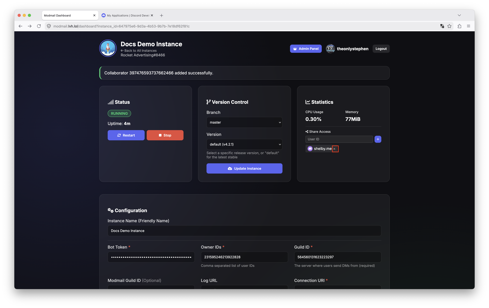</figure>

If you have had a bot shared with you that you no longer wish to have access to, you can use the **Leave Instance** button as seen in the red box below:
<figure>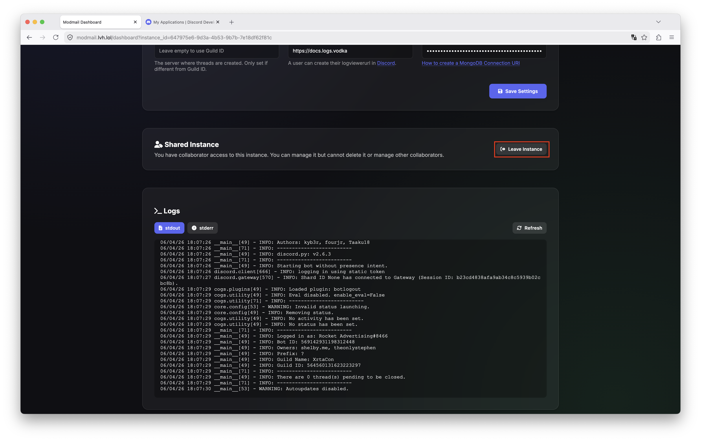</figure>

Version History



## Initial Creation

Initial creation of docs page for using the Modmail Panel.



