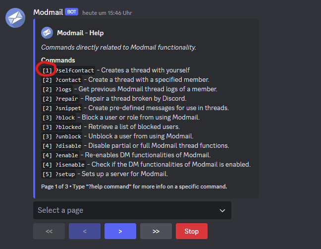

# Permissions

The modmail bot comes with an advanced permission system that makes it able to choose which individual users or users with certain roles can use modmail specific commands.

The permission levels are the following:
* Owner \[5]
* Administrator \[4]
* Moderator \[3]
* Supporter \[2]
* Regular \[1]

You can view each permission level that is required for the specific command inside the help command.

<figure></figure>

## Setting up permissions
These permissions can added in two different ways.

### Adding a level to a role or user
`?permissions add level [name] [role/user]`

Examples:

* `?perms add level Regular everyone`
* `?perms add level Moderator @mods`
* `?perms add level Owner @user`

### Adding a command to a role or user

`?permissions add command [name] [role/user]`

Examples:

* `?perms add command reply @user`
* `?perms add command "plugin enabled" @role`
* `?perms add command help 984301093849028`

## Override Permission Level
In some cases it can be useful to override a command permission level.
This can be done like this:

`?permissions override <command_name> <level_name>`

Examples:

* `?perms override reply administrator`
* `?perms override "plugin enabled" moderator`

### Bulk Permissions Override

Starting in v4.2.2 (check version with `?about`), permissions can be overridden in bulk. To start the process run:

`?permissions override bulk``  

***
If you need help setting up permissions, feel free to join our [Discord server](https://discord.gg/zmdYe3ZVHG) and DM Modmail. One of our support members will help you.